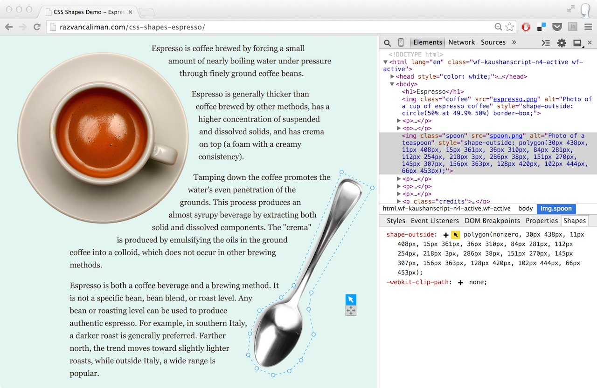
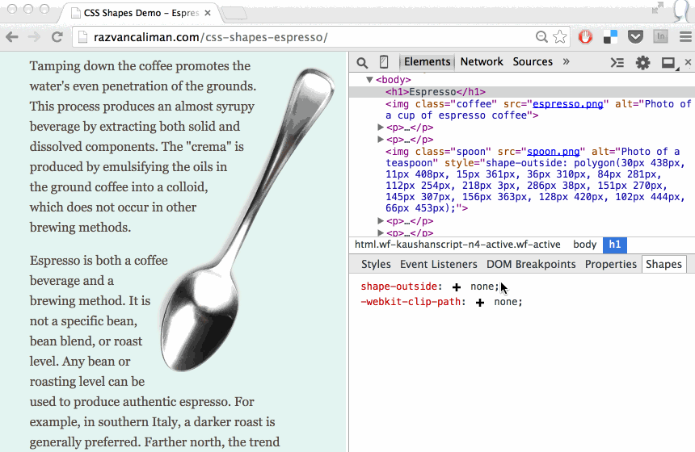
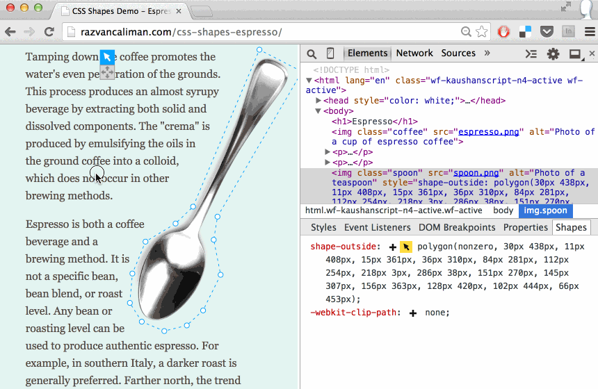
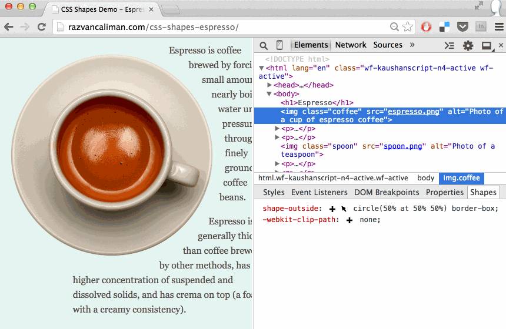

# CSS Shapes Editor for Chrome

CSS Shapes allow web designers to wrap content around custom paths, but authoring them is not trivial.

None of the traditional tools used in web design currently export code for CSS Shapes and the syntax conversion workflow is unwieldy and time-consuming. It wouldn't help too much even if they did. CSS Shapes are meant to be used in the browser context where it's easy to see how they interact with other elements on the page in various configurations. The shape authoring process should capitalize on this affordance, something external editing tools are not well equipped to do.

To solve this problem, I released the [CSS Shapes Editor for Chrome](https://chrome.google.com/webstore/detail/css-shapes-editor/nenndldnbcncjmeacmnondmkkfedmgmp). It is a Developer Tools extension which provides an interactive editor for shape property values like `circle()`, `ellipse()` and `polygon()`.

An interactive editor is placed over the selected element. It adds controls to adjust, move, scale and rotate the shape while getting instant visual feedback of how that impacts the layout. This makes working with CSS Shapes much more practical and, dare I say it, more fun because it's easier to experiment with shape ideas right there in the browser.

## How to use

[Install the extension](https://chrome.google.com/webstore/detail/css-shapes-editor/nenndldnbcncjmeacmnondmkkfedmgmp) from the Chrome Web Store.

The extension adds a new sidebar to the Elements panel, called __Shapes__. This sidebar lists the computed style of shape and clip-path properties for the selected element. Click the "pointer" icon next to a property value to edit an existing path, or click the "plus" icon to create a new one.

For polygons, click on the edges of the interactive editor to add new vertices, drag the points to adjust the shape or double-click an existing point to delete it.

To switch to transform mode, click the "move" icon in the interactive editor's toolbar, then move, scale and rotate the polygon shape.

Circles and ellipses only get the transform mode for scaling and moving, but not for rotation.

All CSS unit types can be used with CSS Shapes. By default, the CSS Shapes Editor uses pixels, but it understands other units too. Sometimes it's useful to change the unit type of a shape's coordinates, for example to make it responsive. Here's a nifty trick: hold down the _Shift_ key and click on the "pointer" icon. This cycles though a list of unit types and converts the shape coordinates.

Did you know you can use the same _Shift_+click trick to convert the color value syntax in the _Styles_ panel? [Umar Hansa](https://twitter.com/umaar) shares a lot of DevTools tricks.

CSS Masking's `clip-path` property uses the same syntax as CSS Shapes, so it is possible to reuse the CSS Shapes Editor. That's why the `clip-path` computed value is also available in the extension sidebar.

## Origins

I became acutely aware of the need for a CSS Shapes editor while building the original [Alice in Wonderland demo](https://www.youtube.com/watch?v=VON2shFlsKU). The grueling process of going back-and-forth between a vector editing tool, the code editor, and the browser to check the results, even for minuscule tweaks, drove me insane. I lost hours of my life working frustrated like that before I decided to put some energy into building an in-browser tool to help me get the work done. The prototype tool proved to be very useful. I received wonderful support from peers and from my manager to build and release it publicly for everyone to use.

The CSS Shapes Editor for Chrome uses the same underlying interactive [shapes editor library](https://github.com/adobe-webplatform/css-shapes-editor) as the [CSS Shapes Editor for Brackets](http://blog.brackets.io/2014/04/17/css-shapes-editor/) extension. I built all of these over time, but it is by no means a singular effort. What you see today is the result of a lot of work done by [a few people](https://github.com/adobe-webplatform/css-shapes-editor#thanks) who contributed both directly and indirectly, knowingly and unknowingly. Thank you, all!

## Going forward

The CSS Shapes Editor for Chrome is a labor of love, above anything else. I sincerely  believe it will be useful in your workflow as you explore how to use CSS Shapes and change the way content is presented on the web beyond simple boxes.

I leave you with a [collection](http://www.behance.net/collection/25035325/Shapes) of work by others, mostly in print, in hopes that it may inspire you to try out shapes on the web.
