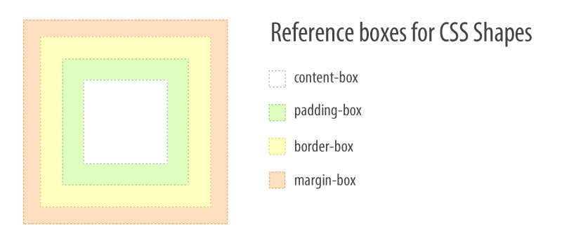
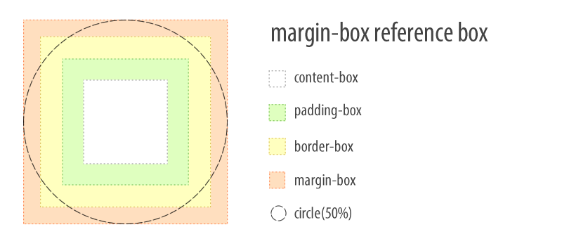
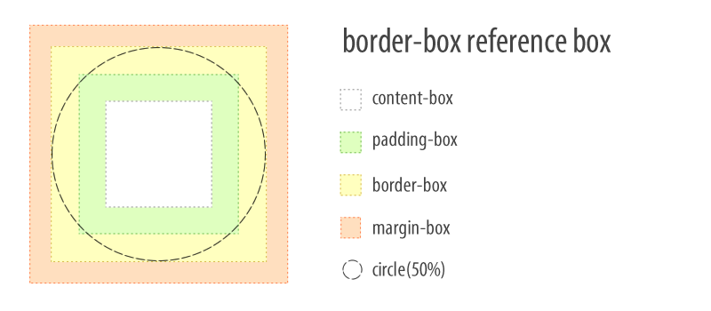
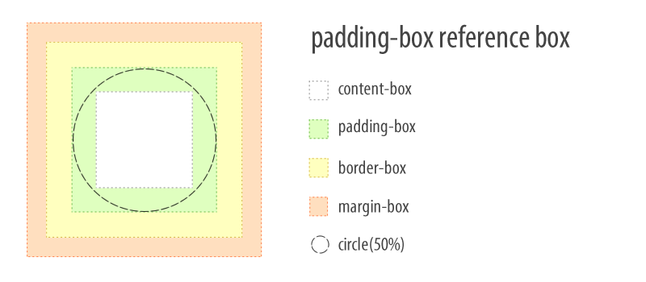
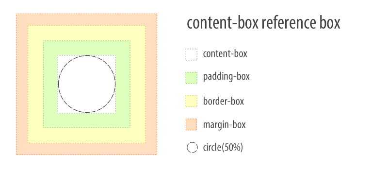

# Understanding Reference Boxes for CSS Shapes

<p class="meta">
<time datetime="2012-07-24 00:00">24 Jul 2014</time> - London
</p>

[CSS Shapes](http://alistapart.com/article/css-shapes-101) are used to wrap content around custom paths. The paths are defined with shape function values, like `circle()`, `ellipse()`, `inset()` or `polygon()`, and they are positioned within a virtual box, the reference box.

A reference box defines the shape's coordinate system, so it influences how the shape will be drawn and positioned. There are four reference boxes to choose from: `margin-box`, `padding-box`, `border-box` and `content-box`. Each of them yields subtly different results. Read on to learn how they work.



We'll consider a simple circle shape around which we will wrap content. We'll use percentages for the circle radius to observe how reference boxes influence the resulting shape.

```css
.shape{
  shape-outside: circle(50%);
  float: left;
  width: 100px;
  height: 100px;
}
```

## The margin-box

If unspecified, the default reference box for a shape is `margin-box`. The CSS shape declaration above is equivalent to `shape-outside: circle(50%) margin-box;`.

The `margin-box` reference box means that a shape is positioned in a virtual box defined by the outer edges of the host element's margin. The origin of the coordinate system is at the upper-left corner of this box, with the X axis going from left to right and the Y axis going from top to bottom.

We didn't specify a margin in our sample yet, so the `margin-box` reference box does not extend beyond the element's content area. It's still ok to imagine the origin of the coordinate system for the shape placed at the upper-left corner of the element.

At this point, the circle's 50% radius yields an actual length of 50px (half the element's width or height).

The shape changes when we do specify a margin.

```css
.shape{
  margin: 50px;
  shape-outside: circle(50%);
  float: left;
  width: 100px;
  height: 100px;
}
```

After setting `margin: 50px`, the `margin-box` reference box extends around the element by 50px in all directions. It builds on the element's dimensions, so the reference box becomes 200px by 200px.

The circle's 50% radius now yields an actual length of 100px and the origin is outside the element’s content area, at the upper left corner of the box defined by the margin.




We use the `margin-box` reference box when it's important to wrap content around a shape which stretches beyond the dimensions of the host element.

### Margins and shapes

It's __very important__ to understand that all reference boxes define coordinate systems for shapes, but only the `margin-box` reference box actually clips the shape. This means that shapes larger than other reference boxes will eventually be clipped by the `margin-box`. Therefore, an element's margin can be used to increase the surface where the shape will draw, if it extends beyond other reference boxes.

## The border-box

As its name implies, the `border-box` reference box constrains the shape's coordinate system to the box defined by the outer edges of the element's border. In this case, the shape may overlap the element's border, and can extend beyond it if there is a margin around the element.

```css
.shape{
  border: 25px solid pink;
  shape-outside: circle(50%) border-box;
  float: left;
  width: 100px;
  height: 100px;
}
```

After applying a thick 25px solid border, which, by default, grows the element in all directions, the reference box will be 150px by 150px, (width + 2 \* 25px) by (height + 2 \* 25px), and the circle's 50% radius yields 75px.



However, if we use `box-sizing: border-box` (note the different property), a different algorithm for computing the box model applies and the border value is subtracted from the element's dimensions in such a way that the element's overall size does not change, but its surface for inner content is reduced. In that case, the reference-box ends up being 100px by 100px.

Similar to `padding-box`, the `border-box` reference box helps keep the shape synchornized with the position of the element if margins are used.

We use the `border-box` reference box when it's necessary for the shape to overlap the element's border and keep in sync with the border if that changes.

## The padding-box

The `padding-box` reference box constrains the shape's coordinate system to the box defined by the outer edges of the element's padding.

Let's use the `padding-box` reference box and specify a padding.

```css
.shape{
  padding: 25px;
  shape-outside: circle(50%) padding-box;
  float: left;
  width: 100px;
  height: 100px;
}
```

After setting `padding: 25px` the element grows by 25px in all directions. This effect occurs only if the element's `box-sizing` property value remains unchanged from the browser's default of `content-box`.

In this scenario, the reference box becomes 150px by 150px, (width + 2 \* 25px) by (height + 2 \* 25px). The circle's 50% radius now means 75px, and the coordinate system origin is at the upper left corner of the box defined by the padding.



If we use `box-sizing: border-box`, this makes the browser subtract the necessary space for the padding from the element's dimensions, thus reducing the surface for inner content. In this scenario, the reference box becomes 100px by 100px and the circle's 50% radius yields 50px.

In both scenarios, the margin property can be used to adjust the position of the element together with its shape.

We use the `padding-box` reference box when it's necessary for wrapped content to overlap part of the host element.

## The content-box

The `content-box` reference box constrains the shape's coordinate system to the available space for content within the element.

It is common for at least one of the element's dimension to not be explicitly defined, for example `width` may be set, but `height` may be derived from the amount of content. This causes the reference box and the resulting shape to be directly influenced by the element's content.

Let's look at two examples with `content-box` reference box.

```css
.shape{
  shape-outside: circle(50%) content-box;
  float: left;
  width: 100px;
  height: 100px;
}
```

When both dimensions are explicitly set it is predictable what the reference box will be: the box defined by the width and height properties. Even though padding and border may grow the element's perceived size, the reference box remains tied to the initial dimensions.




Using `box-sizing: border-box` will, of course, subtract padding and border from those dimensions and the reference box will be identical to the surface that's left available. If the subtraction causes the remaining surface to be zero or negative, there will be no visible shape because there is nowhere to draw it.

That was the predictable case. However, if one of the dimensions isn't defined, the reference box can vary wildly according to other constraints.

```css
.shape{
  shape-outside: circle(50%) content-box;
  float: left;
  width: 100px;
  /* height: 100px; */
}
```

Notice that we commented-out the explicit `height` property. Now, the `content-box` reference box depends on the amount of content within the element with the "shape" class. Different `font-size` values or relative size units will also have an impact on the reference box.

### Variable dimension reference boxes
For simplicity's sake, in the examples so far, we used dimensions that get us a a square element. In those cases the circle's radius would equate to half the square's edge.

However, computing radii as percentage units for `circle()` and `ellipse()` depends on a slightly more complicated [formula](http://www.w3.org/TR/css-shapes/#funcdef-circle): sqrt(width<sup>2</sup> +height<sup>2</sup>)/sqrt(2). This is a special case only for `circle()` and `ellips()` radii; other shape functions, like `polygon()`, are not constrained by this.

Understanding this formula becomes important for mentally visualizing the `content-box` reference box when the amount of content can influence one or both dimensions. It's worth noting that this case of variable dimension applies with the other reference boxes as well, it's not endemic to `content-box`.


In the illustration above we observe that the circle does not touch the content-box top and bottom edges yet it extends beyond its left and right edges. This is expected and happens because of two reasons: 1) the radius is computed out of the element dimensions with the formula mentioned above, and 2) we omitted defining where the circle's center should be, so the default was used &mdash; the center of the coordinate system (the intersection of the element's diagonals in this case).

At first glance, it looks like the `content-box` reference box is too much of a hassle to be worthwhile. However, there is a valid use case: progressive shape disclosure. This means we can create a shape which is much larger than what's immediately needed or visible, but as the amount of content increases more of the shape gets revealed.

Imagine using `polygon()` to create a saw-like shape which runs down along the side of the element. CSS Shapes do not yet have a "repeat" property. Using progressive shape disclosure with the `content-box` reference box is a way to achieve the same effect using larger shapes composed of a repeated pattern.


Remember, the `margin-box` does the actual clipping of oversized shapes. If there is a margin around the element, the shape may extend beyond the `content-box`, only to be clipped by the `margin-box`.


## Creating shapes from reference boxes

It is possible to skip the shape function definition and to infer the shape from the element's reference box. This is particularly useful when `border-radius` is used, because that property can influence the shape of the reference box.

```css
.shape{
  border-radius: 50px;
  shape-outside: margin-box;
  float: left;
  width: 100px;
  height: 100px;
}
```

The `border-radius` on its own does clip the element, but it does not affect the float area around it &mdash; that remains rectangular. Adding `shape-outside: margin-box;` (notice, no shape function), the float area around the element respects the shape from `border-radius`.

To a great extent, all reference boxes work as previously defined in conjunction with border radii, but there are [special cases to consider](http://www.w3.org/TR/css-shapes/#shapes-from-box-values).

Skipping shape functions and inferring shape from the reference box may come useful when the element is already clipped with `border-radius` and duplication of the shape isn't necessary.


Creating shapes with `border-radius` sounds deceptively simple, maybe even trivial, but [Lea Verou](@LeaVerou) does an excellent job explaining the property's underlying expressive power in her talk, ["The Humble Border-Radius"](https://www.youtube.com/watch?v=JSaMl2OKjfQ).

## Quick reference

The table below provides a quick reference on how to compute reference boxes.

reference box | if default `box-sizing` | if `box-sizing: border-box`
--- | --- | ---
`content-box` | width + height                             | width + height
`padding-box` | width + height + padding                   | width + height - padding
`border-box`  | width + height + padding + border          | width + height - padding - border
`margin-box`  | width + height + padding + border + margin | width + height - padding - border + margin

## Conclusion

Reference boxes help us control the sizing and positioning of CSS Shapes.

They abstract away some of the complexity of coordinate systems and free us from having to manually define dimensions for each element. This contributes to making responsive shapes which are portable both across screens and between projects.

Many thanks to [Alan Stearns](https://twitter.com/alanstearns) and [Sara Soueidan](https://twitter.com/sarasoueidan) for reviewing this article.

Have fun!
